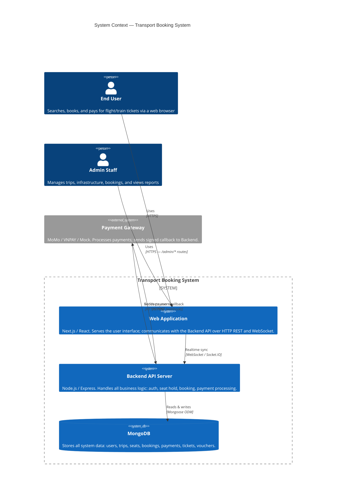
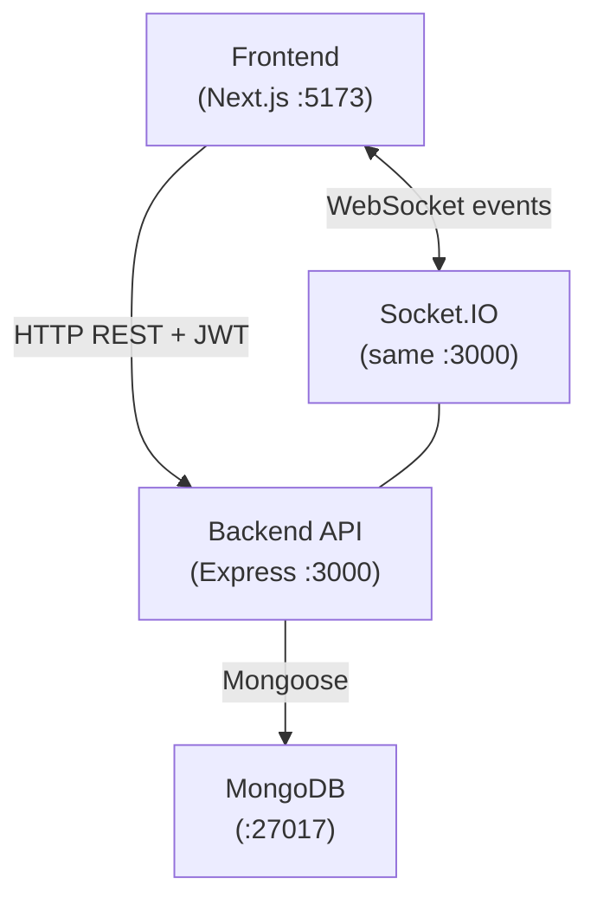

# 01 — System Context

**Last Updated:** 2026-03-05  
**Status:** Active  
**Section:** arc42 Chapter 3 — Context & Scope

---

## 1. System Context Diagram

---

## 2. External Interfaces

### 2.1 Browser → Frontend

The frontend is a Next.js application served at `http://localhost:5173` (dev) or `https://yourdomain.com` (prod). The frontend communicates with the backend via:

- **HTTP REST:** All API calls use `VITE_API_BASE_URL` as the base. Authenticated requests include `Authorization: Bearer <token>`.
- **WebSocket:** A persistent Socket.IO connection to `VITE_SOCKET_URL` for real-time seat map updates.

### 2.2 Frontend → Backend API

| Base Path | Auth Required | Purpose |
|---|---|---|
| `/api/auth/*` | Public | Registration, login |
| `/api/public/*` | Public | Airports, airlines, stations, trains (for search form dropdowns) |
| `/api/flights/*` | Public | Flight search and detail |
| `/api/train-trips/*` | Public | Train trip search and detail |
| `/api/trips/*` | Public | Seat map retrieval |
| `/api/seats/*` | JWT (USER) | Hold and release seats |
| `/api/bookings/*` | JWT (USER) | Create and view bookings |
| `/api/payments/*` | Signature only | Payment callback (no JWT) |
| `/api/vouchers/*` | JWT (USER) | Apply vouchers |
| `/api/admin/*` | JWT (ADMIN) | Full admin management |
| `/api/health` | Public | Server health check |

### 2.3 Payment Gateway Callback

The payment gateway sends a `POST /api/payments/callback` request after a payment attempt. The backend must:

1. Verify the payload signature using `PAYMENT_WEBHOOK_SECRET`.
2. Match `bookingId` to an existing `PENDING_PAYMENT` booking.
3. Execute the confirmation transaction atomically (see [06-runtime/02-payment-flow.md](../06-runtime/02-payment-flow.md)).
4. Return `200 OK` regardless of outcome (gateways retry on non-2xx responses).

---

## 3. Internal Communication

All containers share a single Docker bridge network (`tbs-network`). MongoDB is **not** exposed on the host in production — only the backend accesses it internally.

---

## 4. Boundaries

| Inside System Boundary | Outside System Boundary |
|---|---|
| Frontend web app | User's browser / device |
| Backend API server | Payment gateway (MoMo / VNPAY) |
| MongoDB database | Email delivery service (future) |
| Socket.IO server (co-located with backend) | Mobile apps (out of scope) |
