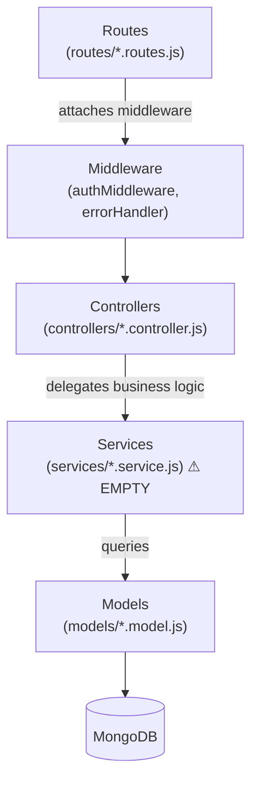
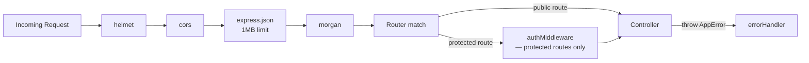

# 01 — Backend Components

**Last Updated:** 2026-03-05  
**Status:** Active  
**Section:** arc42 Chapter 5 — Building Blocks

---

## 1. Technology Stack

| Component | Technology | Version |
|---|---|---|
| Runtime | Node.js | LTS 20 |
| Language | JavaScript | CommonJS (`.js`, `require/module.exports`) |
| HTTP Framework | Express.js | ^4.19 |
| Database ODM | Mongoose | ^8.12 |
| Database | MongoDB | 7 |
| Authentication | jsonwebtoken | ^9.0 |
| Password hashing | bcrypt | ^6.0 |
| Realtime | socket.io | *(not yet installed — required)* |
| Input validation | Zod or Joi | *(not yet installed — required)* |
| HTTP logging | Morgan | ^1.10 |
| Security headers | Helmet | ^7.1 |
| Process management (dev) | Nodemon | ^3.1 |

---

## 2. Directory Structure

```
backend/
├── src/
│   ├── server.js          # Entry point: connectDB() → app.listen()
│   ├── app.js             # Express app: middleware stack + route mounting
│   │
│   ├── config/
│   │   ├── env.js         # Reads process.env, exports typed config object
│   │   └── db.js          # mongoose.connect() using env.mongoUri
│   │
│   ├── routes/            # express.Router() definitions — URL + verb → controller
│   │   ├── auth.routes.js
│   │   ├── booking.routes.js
│   │   ├── seat.routes.js
│   │   ├── search.routes.js    ⚠ NOT MOUNTED in app.js (bug — must fix)
│   │   └── health.routes.js
│   │
│   ├── middleware/
│   │   ├── authMiddleware.js   # JWT verify → req.user = { userId }
│   │   └── errorHandler.js     # Catches thrown errors → standardized response
│   │
│   ├── controllers/       # Parse req → call service → send res
│   │   ├── auth.controller.js
│   │   ├── booking.controller.js
│   │   ├── seat.controller.js
│   │   └── search.controller.js
│   │
│   ├── services/          # ⚠ EMPTY — all business logic must move here
│   │
│   ├── models/            # Mongoose schema + model exports
│   │   ├── users.model.js
│   │   ├── flights.model.js
│   │   ├── seats.model.js
│   │   ├── bookings.model.js
│   │   ├── payments.model.js
│   │   ├── tickets.model.js
│   │   ├── vouchers.model.js
│   │   ├── airlines.model.js
│   │   ├── airports.model.js
│   │   ├── trains.model.js
│   │   ├── trainTrips.model.js
│   │   ├── trainStations.model.js
│   │   └── trainCarriages.model.js
│   │
│   ├── jobs/              # ⚠ EMPTY — cron job for seat TTL expiry required
│   │
│   └── scripts/
│       └── seed.js        # Populates MongoDB with dev test data
│
├── prisma/
│   └── schema.prisma      # ⚠ Empty — safe to delete (Prisma not used, per ADR-0001)
│
├── package.json
└── .env.example           # ⚠ Does not yet exist — must be created
```

---

## 3. Layer Architecture



**Layer responsibilities:**

| Layer | Responsibility | Must NOT |
|---|---|---|
| Routes | Map HTTP verb + URL to controller. Attach middleware. | Contain any logic |
| Middleware | Cross-cutting: auth, error handling, logging | Call business services directly |
| Controllers | Parse `req`, call service, format and send `res` | Contain business logic or call Mongoose directly |
| Services | All business rules, validations, transactions | Import `req` / `res` from Express |
| Models | Mongoose schema + virtual/instance methods | Contain business rules |

---

## 4. Middleware Chain



---

## 5. Config Module (`config/env.js`)

All environment variable reads are centralized in `config/env.js`. No other file should read `process.env` directly.

```javascript
// config/env.js — current shape
module.exports = {
  nodeEnv:              process.env.NODE_ENV || 'development',
  port:                 Number(process.env.PORT || 3000),
  mongoUri:             process.env.MONGO_URI || 'mongodb://localhost:27017/transport_booking',
  corsOrigin:           process.env.CORS_ORIGIN || 'http://localhost:5173',
  jwtSecret:            process.env.JWT_SECRET || 'dev_secret_change_me',
  seatHoldTtlMinutes:   Number(process.env.SEAT_HOLD_TTL_MINUTES || 15),
  // ── Required additions ──────────────────────────────────────────────────
  jwtExpiresIn:         process.env.JWT_EXPIRES_IN || '1h',
  paymentProvider:      process.env.PAYMENT_PROVIDER || 'MOCK',
  paymentWebhookSecret: process.env.PAYMENT_WEBHOOK_SECRET || '',
  logLevel:             process.env.LOG_LEVEL || 'info',
};
```

---

## 6. Known Bugs (Must Fix)

| Bug | Location | Fix |
|---|---|---|
| `search.routes.js` not mounted | `app.js` | Add `app.use('/api/search', searchRoutes)` |
| `routes/index.js` spawns a second server | `routes/index.js` | Replace with a barrel export or delete |
| `hold_expired_at` stores a `Number` instead of `Date` | `seat.controller.js:22` | `new Date(Date.now() + env.seatHoldTtlMinutes * 60 * 1000)` |
| `getAllBookings` returns all users' bookings | `booking.controller.js:54` | Filter with `{ user_id: req.user.userId }` |
| `authMiddleware` reads `process.env.JWT_SECRET` directly | `authMiddleware.js:13` | Use `env.jwtSecret` from `config/env.js` |

---

## 7. Required Additions (Not Yet Built)

| Component | File | Priority |
|---|---|---|
| Services layer | `src/services/*.service.js` | P1 — required before unit testing |
| Seat TTL cron job | `src/jobs/seat-release.job.js` | P1 — seat hold never auto-releases |
| Socket.IO server | `src/server.js` + `src/sockets/` | P1 — realtime sync is non-functional |
| `authorize(role)` middleware | `src/middleware/authorize.js` | P1 — admin routes have no role check |
| Input validation | `src/middleware/validate.js` + Zod schemas | P2 — no input validation on any endpoint |
| Payment callback route | `src/routes/payment.routes.js` | P1 — gateway callbacks have no handler |
