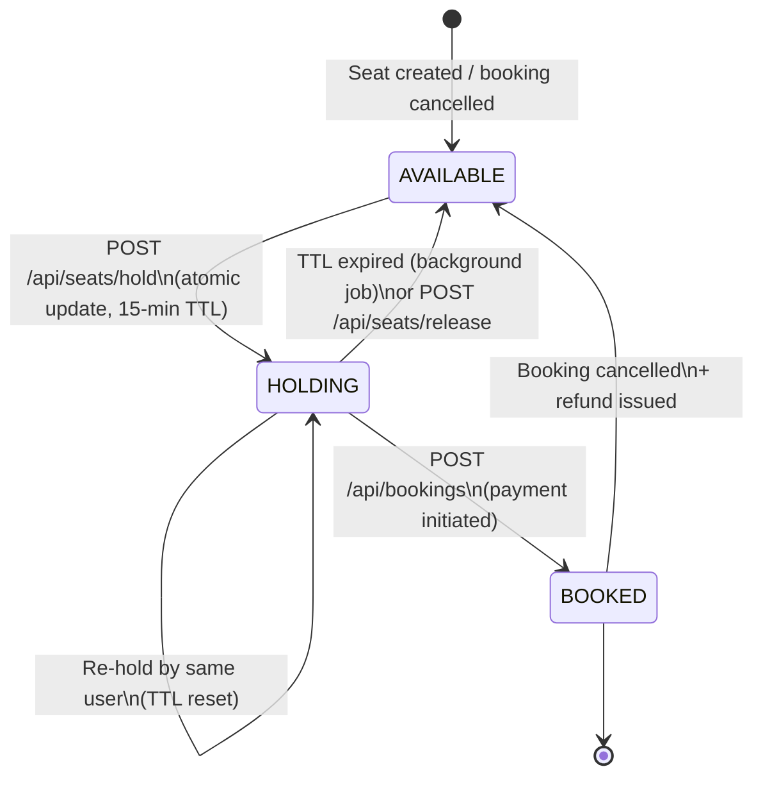
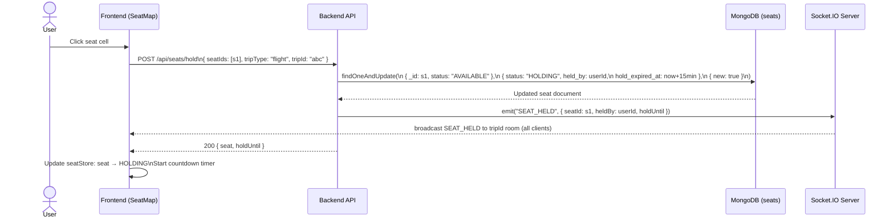
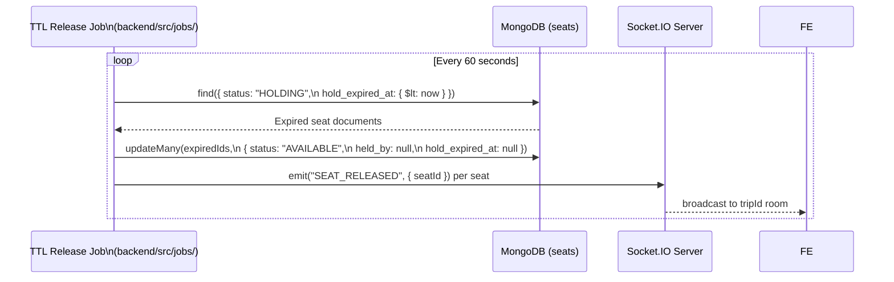
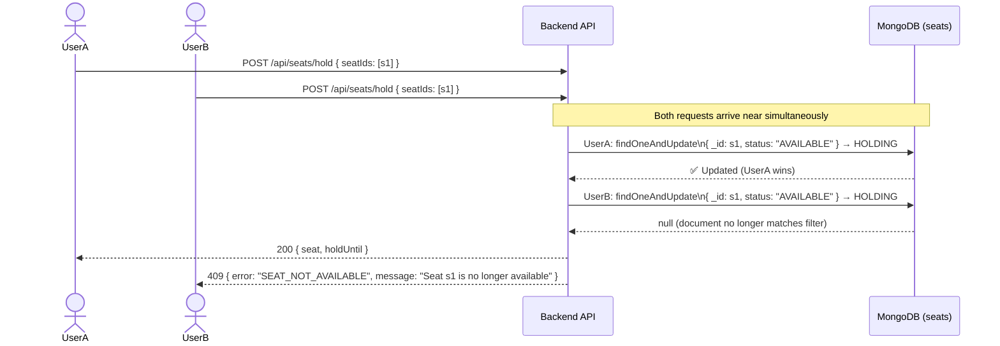
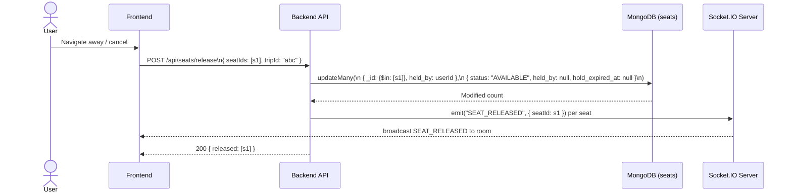
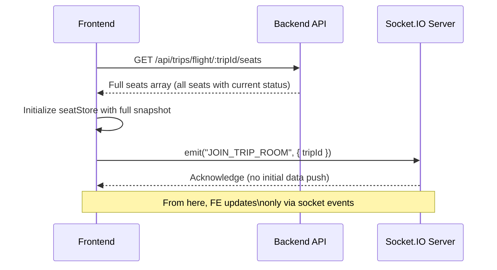

# 01 — Seat Hold Flow

**Last Updated:** 2026-03-05  
**Status:** Active  
**Section:** arc42 Chapter 6 — Runtime View

---

## 1. Seat Status State Machine

**Status definitions:**

| Status | Meaning | Who can transition out |
|---|---|---|
| `AVAILABLE` | No hold, open for booking | Any authenticated user (hold action) |
| `HOLDING` | Reserved for a specific user for 15 minutes | Same user (release / book) or background job (TTL expiry) |
| `BOOKED` | Confirmed in a booking | Admin (cancel + refund) |

---

## 2. Happy Path — Seat Hold

---

## 3. TTL Expiry Flow

> **Current status: NOT IMPLEMENTED.** No background job exists. The hold TTL is set correctly in the database but holds are never automatically released.

**Required implementation:** `backend/src/jobs/seatHoldExpiry.job.js` — scheduled with `node-cron` or `setInterval`.

---

## 4. Concurrent Hold Conflict

The atomic `findOneAndUpdate` with a `{ status: "AVAILABLE" }` filter prevents double-booking at the database level.

---

## 5. Release Flow

**Security rule:** The release endpoint must only release seats held by `req.user.userId`. A user cannot release seats held by another user.

---

## 6. Frontend Seat Map Sync on Join

When a user opens a trip detail page, the frontend must fetch full seat state before relying on WebSocket events.

This two-step pattern (REST snapshot + WebSocket delta updates) prevents stale data after reconnects.
