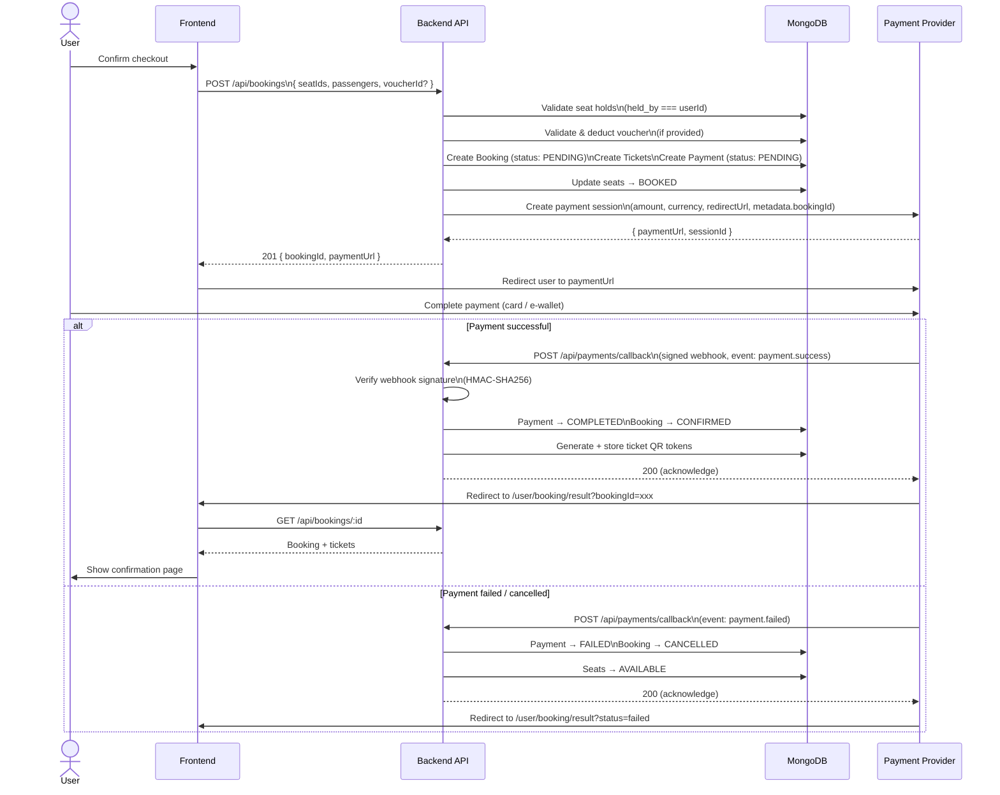
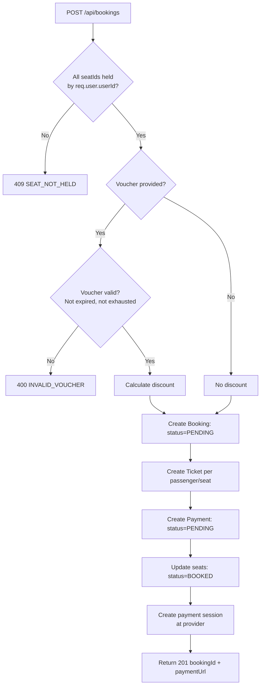
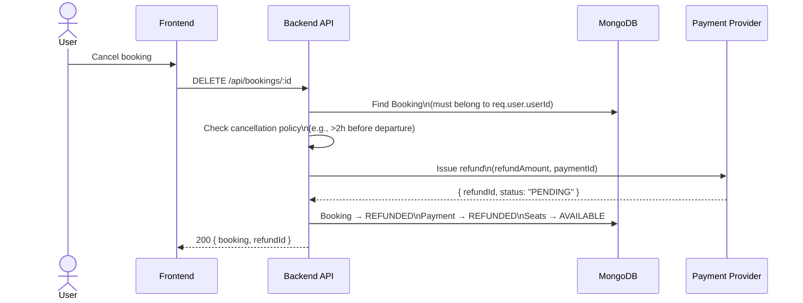
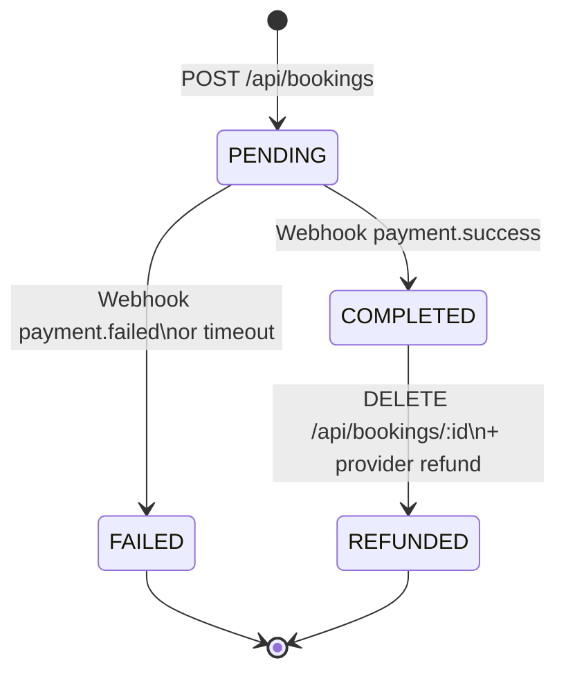

# 02 — Payment Flow

**Last Updated:** 2026-03-05  
**Status:** Active  
**Section:** arc42 Chapter 6 — Runtime View

---

## 1. Payment Flow Overview

The system uses an **external payment provider** (e.g., Stripe, VNPay) via a redirect + webhook pattern. The backend never handles raw card data — it only creates a payment session and receives a signed webhook callback.



---

## 2. Booking Creation — Detailed Steps



---

## 3. Webhook Security

All incoming webhook requests to `POST /api/payments/callback` must be verified before processing.

```javascript
// Pattern to implement in payment callback handler
const crypto = require('crypto');
const { paymentWebhookSecret } = require('../config/env');

function verifyWebhookSignature(req) {
  const signature = req.headers['x-webhook-signature'];
  const payload = JSON.stringify(req.body);
  const expected = crypto
    .createHmac('sha256', paymentWebhookSecret)
    .update(payload)
    .digest('hex');
  return crypto.timingSafeEqual(
    Buffer.from(signature, 'hex'),
    Buffer.from(expected, 'hex')
  );
}
```

**Rules:**
- If signature verification fails, return `400` immediately — do not process.
- The callback must be **idempotent**: re-delivery of the same event must not create duplicate bookings.
- The callback must respond with `200` within 5 seconds or the provider will retry.

---

## 4. Refund & Cancellation Flow



**Cancellation rules (to be configured in `config/env.js`):**
- Full refund if cancelled >24h before departure.
- Partial refund (50%) if cancelled 2–24h before departure.
- No refund if cancelled <2h before departure.

---

## 5. Payment States



---

## 6. Known Gaps

| Gap | Priority | Notes |
|---|---|---|
| `POST /api/payments/callback` route does not exist | Critical | Backend has no payment webhook endpoint |
| `paymentWebhookSecret` not in `env.js` | Critical | Must be added before any payment work |
| No cancellation policy enforcement | High | Hard-coded rules or config-driven |
| No ticket PDF / QR generation | Medium | Planned for v2 |
| No retry handling for failed provider calls | Medium | Should use exponential back-off |
