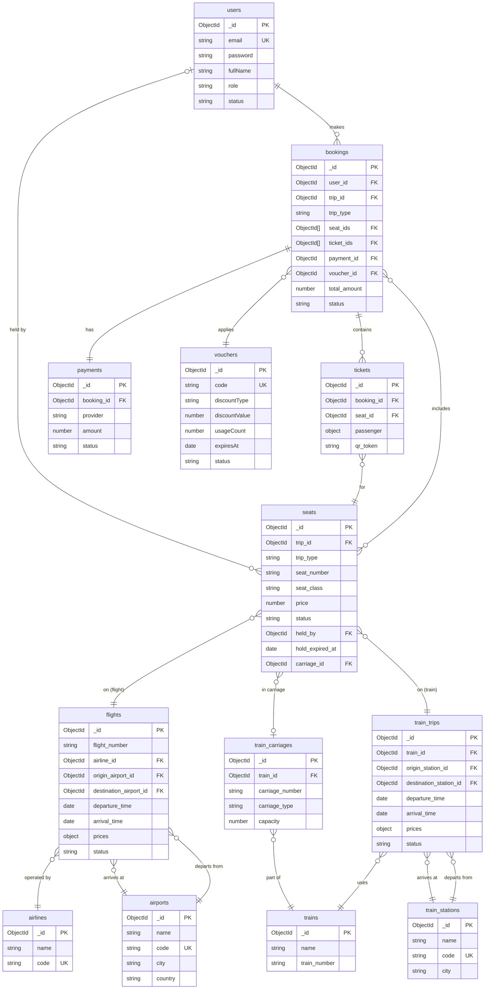
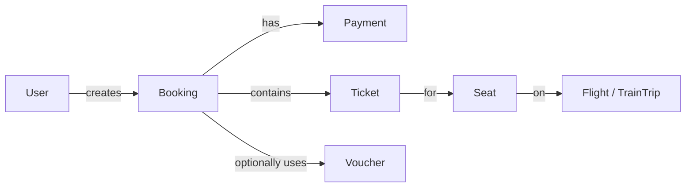
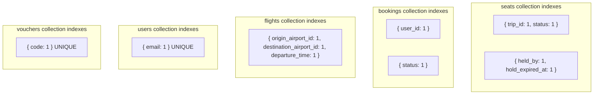

# 02 — Entity Relationship Diagram

**Last Updated:** 2026-03-05  
**Status:** Active  
**Section:** arc42 Chapter 11 — Database

> MongoDB does not enforce foreign keys. The relationships below are maintained at the application layer via Mongoose populate queries.

---

## Core Domain ERD

---

## Booking Flow Relationships

---

## Index Map

