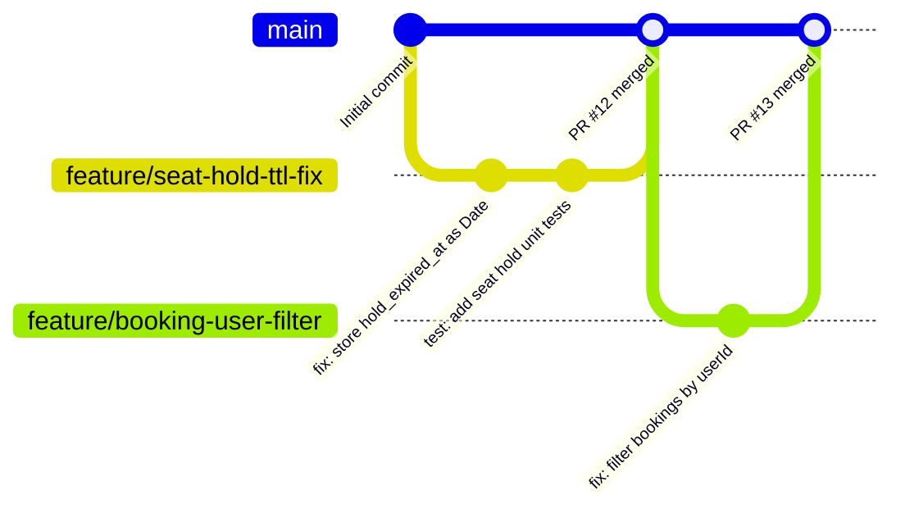

# 03 — Git Workflow

**Last Updated:** 2026-03-05  
**Status:** Active  
**Section:** arc42 Chapter 12 — Developer Guide

---

## Branching Strategy

This project uses a **GitHub Flow** variant — simple enough for a small team, structured enough to protect `main`.



---

## Branch Types

| Branch | Pattern | Created From | Merges To | Description |
|---|---|---|---|---|
| `main` | `main` | — | — | Always deployable. Protected. |
| Feature | `feature/<short-description>` | `main` | `main` (via PR) | New features, bug fixes, refactors |
| Hotfix | `hotfix/<short-description>` | `main` | `main` (via PR) | Critical production fixes |
| Docs | `docs/<short-description>` | `main` | `main` (via PR) | Documentation-only changes |

**Rules:**
- Never commit directly to `main`.
- Branch names use kebab-case and are concise: `feature/seat-hold-job`, not `feature/implement-the-background-job-that-releases-seat-holds`.
- Delete branches after merging.

---

## Standard Workflow

```bash
# 1. Start from an up-to-date main
git checkout main
git pull origin main

# 2. Create a feature branch
git checkout -b feature/your-feature-name

# 3. Make your changes; commit often with meaningful messages
git add .
git commit -m "feat(scope): add thing that does stuff"

# 4. Keep your branch up to date with main (rebase preferred)
git fetch origin
git rebase origin/main

# 5. Push and open a Pull Request
git push origin feature/your-feature-name
# Open PR on GitHub → request review

# 6. After approval and CI passes → Squash and Merge to main
# Then delete the remote branch
```

---

## Pull Request Checklist

Before requesting review, ensure:

- [ ] Code follows conventions in [02-coding-conventions.md](./02-coding-conventions.md)
- [ ] New features have corresponding tests
- [ ] No `console.log` statements left in production code
- [ ] No `.env` or credentials committed
- [ ] `docs/` is updated if the change affects architecture or API
- [ ] PR title follows Conventional Commits format (`feat(scope): description`)

---

## Commit Message Reference

See [02-coding-conventions.md — Commit Messages](./02-coding-conventions.md#commit-message-format) for the full format and type table.

---

## Tag Strategy

Release tags follow Semantic Versioning (`MAJOR.MINOR.PATCH`):

```bash
# Tag a release
git tag -a v1.0.0 -m "Release v1.0.0 — booking flow complete"
git push origin v1.0.0
```

| Increment | When |
|---|---|
| `PATCH` | Bug fix with no new APIs |
| `MINOR` | New feature, backward compatible |
| `MAJOR` | Breaking API change |
