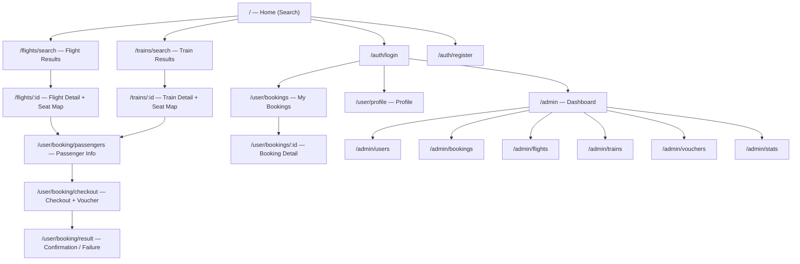

# 04 — UI Pages & Sitemap

**Last Updated:** 2026-03-05  
**Status:** Active  
**Section:** arc42 Chapter 12 — Developer Guide

---

## Sitemap



---

## Page Specifications

### Public Pages (No auth required)

| Page | Route | Key Components | Primary Action |
|---|---|---|---|
| Home / Search | `/` | `SearchForm` | Set route + date + class, submit search |
| Flight Results | `/flights/search` | `TripCard`, `FilterPanel`, `SortBar` | Select a flight → go to detail |
| Flight Detail | `/flights/:id` | `SeatMap`, `SeatCell`, `TripInfo` | Select seats → proceed to booking |
| Train Results | `/trains/search` | `TripCard`, `FilterPanel` | Select a train trip → go to detail |
| Train Detail | `/trains/:id` | `SeatMap` (carriage view), `TripInfo` | Select seats → proceed to booking |

### Authentication Pages

| Page | Route | Key Components | Primary Action |
|---|---|---|---|
| Login | `/auth/login` | `LoginForm` | Submit → get JWT → redirect to `/user/bookings` |
| Register | `/auth/register` | `RegisterForm` | Submit → get JWT → redirect to home |

### Booking Flow (Auth required — `USER`)

The booking flow is a multi-step wizard. State is shared via `bookingStore` (Zustand).

| Step | Route | Key Components | Primary Action |
|---|---|---|---|
| 1. Seat selection | `/flights/:id` or `/trains/:id` | `SeatMap` | Hold seats via API → proceed |
| 2. Passenger info | `/user/booking/passengers` | `PassengerForm` (per passenger) | Fill names, DOB, passport → next |
| 3. Checkout | `/user/booking/checkout` | `CheckoutSummary`, `VoucherInput`, `PayButton` | Apply voucher → POST /api/bookings → redirect to payment |
| 4. Result | `/user/booking/result` | `ConfirmationCard` or `ErrorCard` | View booking confirmation or retry |

**Booking store state:**
```typescript
interface BookingStore {
  selectedTrip: Trip | null;
  selectedSeats: Seat[];
  passengers: Passenger[];
  voucher: Voucher | null;
  bookingId: string | null;
}
```

### User Pages (Auth required — `USER`)

| Page | Route | Key Components | Notes |
|---|---|---|---|
| My Bookings | `/user/bookings` | `BookingCard`, pagination | List with status filter |
| Booking Detail | `/user/bookings/:id` | `BookingDetail`, `TicketCard` | Shows tickets and QR placeholder |
| Profile | `/user/profile` | `ProfileForm` | Update fullName, phoneNumber, password |

### Admin Pages (Auth required — `ADMIN`)

| Page | Route | Description |
|---|---|---|
| Dashboard | `/admin` | Stats overview: revenue, booking count, seat utilization |
| User Management | `/admin/users` | Table of all users; deactivate, role-change |
| All Bookings | `/admin/bookings` | Table with filters by status, user, trip; issue refunds |
| Flight Management | `/admin/flights` | CRUD; cancel flight (notifies affected bookings) |
| Train Management | `/admin/trains` | CRUD for trains, stations, trips |
| Voucher Management | `/admin/vouchers` | CRUD; view usage counts |
| Analytics | `/admin/stats` | Revenue by route and period |

---

## Guards

| Guard Type | Implementation | Applied To |
|---|---|---|
| Auth check | `useAuth()` → redirect `/auth/login` if no token | All `/user/*` and `/admin/*` pages |
| Role check | Check `user.role === 'ADMIN'` → redirect if not | All `/admin/*` pages |
| Booking flow guard | Check `bookingStore.selectedSeats.length > 0` | `/user/booking/passengers` and `/user/booking/checkout` |

---

## Component Inventory

| Component | Location | Status |
|---|---|---|
| `SearchForm` | `components/search/SearchForm.tsx` | Not implemented |
| `TripCard` | `components/search/TripCard.tsx` | Not implemented |
| `SeatMap` | `components/booking/SeatMap.tsx` | Not implemented |
| `SeatCell` | `components/booking/SeatCell.tsx` | Not implemented |
| `PassengerForm` | `components/booking/PassengerForm.tsx` | Not implemented |
| `VoucherInput` | `components/booking/VoucherInput.tsx` | Not implemented |
| `CheckoutSummary` | `components/booking/CheckoutSummary.tsx` | Not implemented |
| `Header` | `components/layout/Header.tsx` | Not implemented |
| `AdminDataTable` | `components/admin/AdminDataTable.tsx` | Not implemented |
